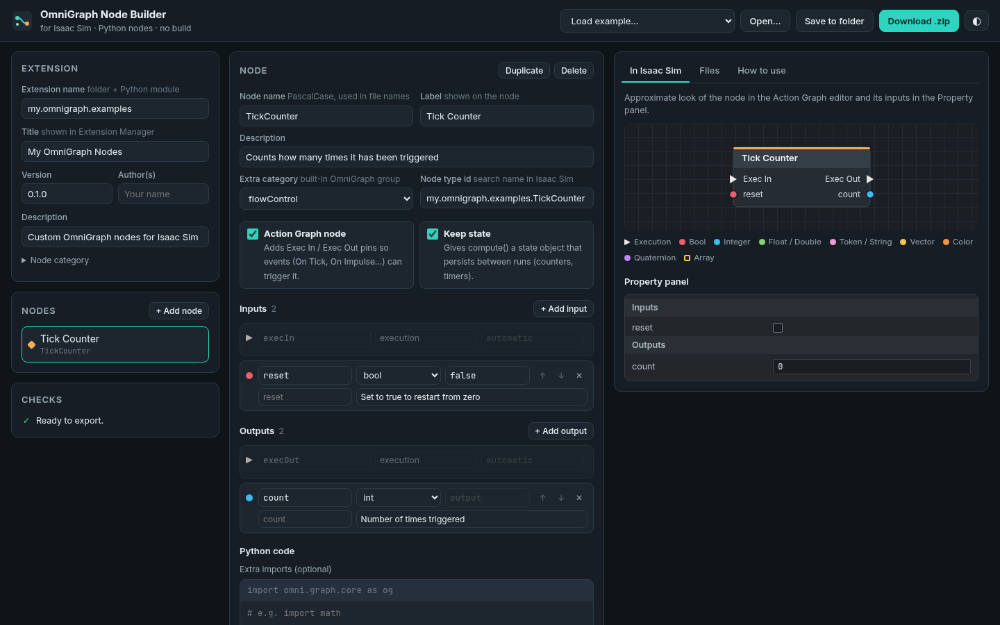

# Isaac Sim OmniGraph Node Builder

**Create Isaac Sim OmniGraph / Action Graph Python nodes with a GUI, with no build step.**

**[Open the builder](https://hrithik-verma.github.io/isaac-sim-omnigraph-node-builder/)**



Pick inputs and outputs, preview how the node looks in the Action Graph editor, and download a ready-to-load
extension with a Python starting template for every node. Then write your own logic: the builder assumes nothing
about it and never overwrites your code. Isaac Sim loads it directly: no premake, no `repo build`, no C++ toolchain.

## Features

- Visual editor for node inputs/outputs: scalars, vectors, colors, quaternions, arrays, execution pins
- **Python starting template** per node, in the style of the Isaac Sim VS Code extension template: an internal
  state class and a `compute()` that (1) reads every input, (2) leaves room for your computation, (3) writes every
  output. It always matches the inputs/outputs you defined.
- **Your code stays yours**: re-open an extension and its `.py` files are kept verbatim. Renaming a node or attribute
  in the GUI also renames it in your code; Checks warns when your code uses names that no longer exist.
  *Save to folder* never overwrites a `.py` you changed.
- **Action Graph option** adds Exec In / Exec Out pins so events (On Playback Tick, On Impulse...) trigger your node
- **ROS 2 option**: publisher or subscriber with a Topic Name input, message type (std_msgs, geometry_msgs,
  sensor_msgs incl. Imu, or custom) and the rclpy setup/cleanup code, using Isaac Sim's ROS 2 bridge.
  For a custom type, paste its `.msg` definition and the template lists every field.
- Live preview of the node and its Property panel, plus every generated file
- Several nodes per extension; starting layouts for math, vector, action, branch, ROS 2 publisher / subscriber
- **Download .zip** (any browser) or **Save to folder** (Chrome / Edge / Opera)
- Validation for names, types and default values before export
- Runs fully in the browser; nothing is uploaded

## Supported Isaac Sim versions

| Isaac Sim | Kit | Python | Status |
|---|---|---|---|
| 5.0 | 107.3 | 3.11 | Tested |
| 5.1 | 107.3 | 3.11 | Same Kit as 5.0 |
| 6.1 | 110.3 | 3.12 | Tested |
| 7.0 (alpha) | 110.3 | 3.12 | Same Kit as 6.1 |

"Tested" means generated nodes were loaded and run in headless Isaac Sim, including Action Graph execution and a
ROS 2 publisher -> subscriber round trip (see [tests](#tests)). Python nodes only; C++ nodes always need a compiled build.

### ROS 2 nodes

Isaac Sim's Python (3.11 / 3.12) cannot use a system ROS 2 such as Humble (Python 3.10). Start Isaac Sim from a
terminal where ROS 2 is **not** sourced, with its internal ROS 2 libraries:

```bash
export ROS_DISTRO=humble RMW_IMPLEMENTATION=rmw_fastrtps_cpp
ISAAC=$(python -c "import isaacsim, os; print(os.path.dirname(isaacsim.__file__))")
export LD_LIBRARY_PATH=$LD_LIBRARY_PATH:$ISAAC/exts/isaacsim.ros2.core/humble/lib     # 6.x / 7.0
# export LD_LIBRARY_PATH=$LD_LIBRARY_PATH:$ISAAC/exts/isaacsim.ros2.bridge/humble/lib # 5.x
```

If ROS 2 is not available the node still loads, and its error message says what to do.

Message packages bundled with Isaac Sim work as-is (std_msgs, geometry_msgs, sensor_msgs, nav_msgs, tf2_msgs,
trajectory_msgs, vision_msgs, visualization_msgs, ackermann_msgs, ...). **Custom messages** must be built for
Isaac Sim's Python, e.g. with NVIDIA's [IsaacSim-ros_workspaces](https://github.com/isaac-sim/IsaacSim-ros_workspaces)
(`./build_ros.sh -d humble -v 22.04` builds for Python 3.12 in Docker); then add the built install folder to
`PYTHONPATH` and `LD_LIBRARY_PATH` before starting Isaac Sim. Until then the node explains which package is missing.

## Use a generated extension

1. Unzip it into a folder that holds your extensions, e.g. `~/isaacsim_exts/my.omnigraph.examples`.
2. In Isaac Sim: **Window > Extensions > (menu) > Settings > Extension Search Paths**, add `~/isaacsim_exts`
   (the **parent** folder).
3. Enable the extension, then find your nodes in **Window > Graph Editors > Action Graph**.

Write your logic in `Ogn<Node>.py` (step 2 of `compute()`); Isaac Sim reloads it while running.

## How it works

OmniGraph scans an extension's Python module folder for `Ogn*.ogn` + `Ogn*.py` pairs and generates the node
database at startup. The builder writes exactly that layout:

```
my.omnigraph.examples/
├── config/extension.toml          [[python.module]] + omni.graph dependency
├── data/icon.png, preview.png
├── docs/README.md, CHANGELOG.md
├── my/omnigraph/examples/
│   ├── __init__.py
│   └── nodes/
│       ├── OgnMathOperation.ogn
│       ├── OgnMathOperation.py         starting template, yours to edit
│       ├── config/CategoryDefinition.json
│       └── icons/icon.svg
└── .ogn-builder.json              lets the builder re-open the project
```

## Development

Plain HTML, CSS and JavaScript modules; there is no build step here either.

```bash
python3 -m http.server 8000      # then open http://localhost:8000
```

- `assets/generator.js`: pure file generator (no DOM), shared by the page and the tests
- `assets/app.js`: the user interface
- `tests/generate.mjs`: generator, validation and import round-trip tests (Node.js 18+)
- `tests/isaacsim_check.py`: loads generated nodes in Isaac Sim and runs them

### Tests

```bash
node tests/generate.mjs /tmp/ogn_out
conda activate isaacsim6            # any Isaac Sim pip environment
python tests/isaacsim_check.py /tmp/ogn_out builder.test.nodes           # add --ros with the ROS 2 setup above
```

## Contributing

Issues and pull requests are welcome, especially reports from other Isaac Sim versions.

## License

[MIT](LICENSE). Community project, not affiliated with or endorsed by NVIDIA. Isaac Sim, Omniverse and OmniGraph
are trademarks of NVIDIA Corporation.
